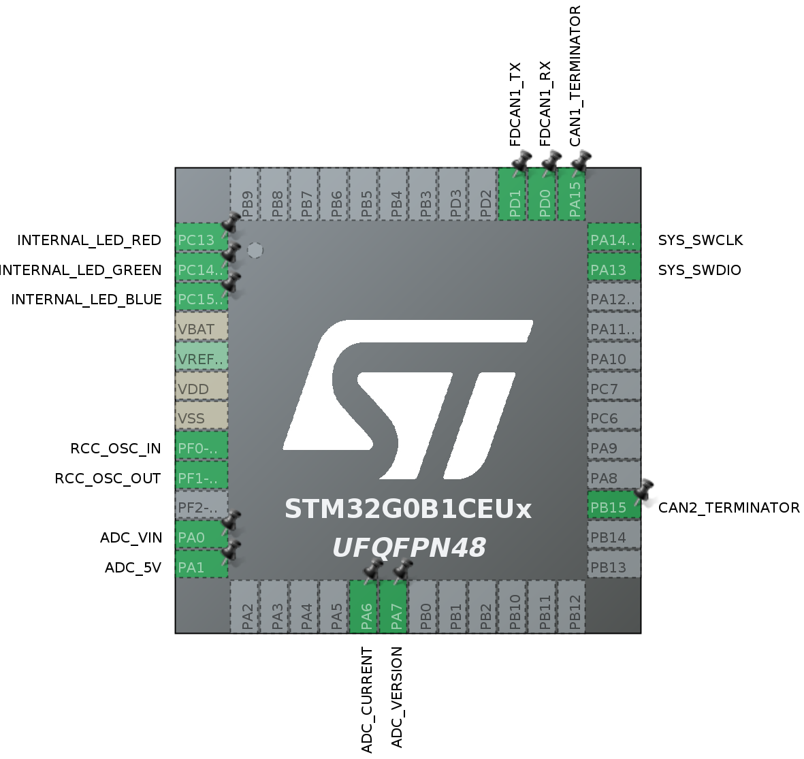

# RaccoonLab Mini v3 node STM32CubeMX generated project  

This repository is based on STM32CubeMX v6.6.0 using STM32Cube FW_G0 V1.6.1.

The peripheral configuration is shown below:

| | |
|-|-|
|  |  |
